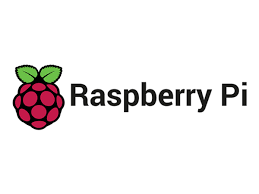
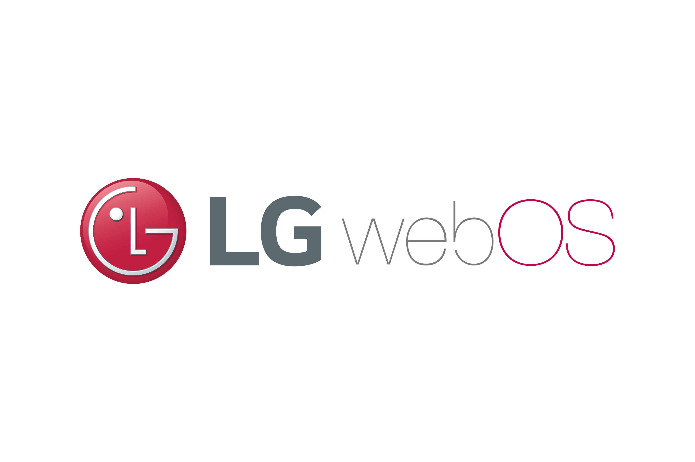

# LG-WEBOS-Internship-Project
> 21.07 ~ 21.08

## 0.Project Name
My Secretary App - on LG Smart TV with Google DialogFlow

## 1.Overview

</img>

My secretary is an application that operates on an AI speaker. This AI speaker is installed on a raspberry pi with sensors and  some JS Functions(Google DialogFlow)

## 

</img>

</img>

>We used LG WEB OS on Raspberry PI and some sensors
